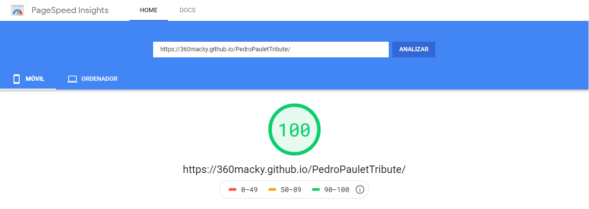
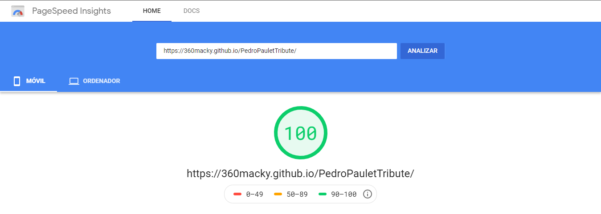

<h1 align="center">👨‍🔬 Pedro Paulet Tribute Page 🎨</h1>

A responsive tribute webpage for Pedro Paulet

<a href="https://360macky.github.io/PedroPauletTribute/" target="_blank">🌎 Go to the page 🚀</a>

  

This project was created as a Responsive Web Design project in [freeCodeCamp](https://freecodecamp.org/).

## ✅ Performance
The **Pedro Paulet Tribute Page** is a highly optimized web page for speed. It was designed for mobile and desktop devices according to *Google PageSpeed Insights*.

🎉 The page was designed and designed according to the recommendations obtained in Google tests, now it scores **100** on mobile and desktop. Amazing!

